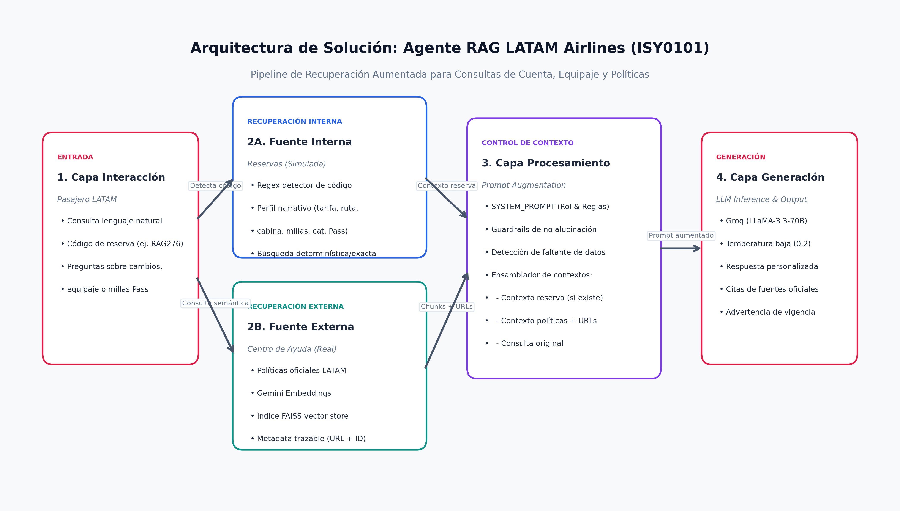

# Agente de Cuenta LATAM Airlines — Pipeline RAG (ISY0101, EP1)

**Evaluación Parcial N°1 — Diseño de Solución con LLM y RAG | Ingeniería de Soluciones con IA (ISY0101), Duoc UC**

Chatbot inteligente que responde consultas de pasajeros sobre **cambios de vuelo, equipaje y Millas LATAM Pass**, combinando el contexto de su reserva (fuente interna simulada) con el contenido oficial del Centro de Ayuda de LATAM (fuente externa real), utilizando el stack del curso: **LangChain + Groq (LLaMA 3.3 70B) + Gemini (text-embedding-004) + FAISS**.

[](https://colab.research.google.com/github/sebastiangome/latam-agente/blob/main/LATAM_RAG_Agent.ipynb)

---

## Integrantes

- Sebastián Gomez
- Rafael Pacheco

---

## Estructura del Repositorio

```text
latam-agente-rag-isy0101/
├── data/
│   └── reservas_latam.csv           # Dataset sintético de perfiles de reserva (200 filas)
├── images/
│   └── diagrama_arquitectura.png    # Diagrama de arquitectura del pipeline RAG (IE4/IE7)
├── .env.example                     # Plantilla de variables de entorno requeridas
├── LATAM_RAG_Agent.ipynb            # Notebook interactivo (Google Colab / Local)
├── README.md                        # Guía de ejecución, arquitectura y documentación
└── requirements.txt                 # Dependencias de Python para ejecución local
```

---

## Arquitectura de la Solución

El sistema opera bajo un pipeline desacoplado en 4 capas:
1. **Capa de Interacción:** Recepción de consultas en lenguaje natural con o sin código de reserva (PNR de 6 caracteres).
2. **Capa de Recuperación Dual:**
   - *Fuente Interna (Reservas):* Extracción exacta y determinística por código PNR (resguardo estricto de privacidad del pasajero).
   - *Fuente Externa (Centro de Ayuda):* Búsqueda semántica sobre políticas indexadas en **FAISS** con embeddings de **Google Gemini (`text-embedding-004`)** recuperando los $k=2$ artículos más pertinentes junto a su URL oficial.
3. **Capa de Procesamiento & Contexto:** Ensamble del prompt dinámico combinando directivas estrictas (`SYSTEM_PROMPT`), datos de la reserva y fragmentos normativos etiquetados con su enlace oficial.
4. **Capa de Generación:** Inferencia de alta velocidad en **Groq** utilizando el modelo `llama-3.3-70b-versatile` con temperatura baja ($T=0.2$).



---

## Instrucciones de Ejecución

### Opción 1: Google Colab (Recomendado — Sin instalación local)

1. Abre el notebook haciendo clic en el badge superior: [](https://colab.research.google.com/github/sebastiangome/latam-agente/blob/main/LATAM_RAG_Agent.ipynb)
2. Obtén tus API keys gratuitas:
   - **`LLM_API_KEY` (Groq):** Regístrate en [console.groq.com/keys](https://console.groq.com/keys).
   - **`GOOGLE_API_KEY` (Gemini):** Regístrate en [aistudio.google.com/apikey](https://aistudio.google.com/apikey).
3. En Google Colab, abre el panel lateral izquierdo **Secrets** → **Add new secret**:
   - Crea `LLM_API_KEY` con tu clave de Groq y activa el interruptor **"Notebook access"**.
   - Crea `GOOGLE_API_KEY` con tu clave de Gemini y activa el interruptor **"Notebook access"**.
4. Ve al menú superior: `Entorno de ejecución` → `Ejecutar todas`.

---

### Opción 2: Ejecución Local

1. Abre la carpeta del proyecto en tu equipo.

2. Crea y activa un entorno virtual de Python:
   - **En Windows (PowerShell / CMD):**
```powershell
     py -m venv .venv
     .venv\Scripts\activate
```
   - **En macOS / Linux:**
```bash
     python3 -m venv .venv
     source .venv/bin/activate
```

3. Instala las dependencias:
```bash
   pip install -r requirements.txt
```

4. Configura tus variables de entorno:
```bash
   cp .env.example .env
```
   Abre `.env` en tu editor y define tus claves:
```env
   LLM_API_KEY=gsk_tu_clave_de_groq_aqui
   GOOGLE_API_KEY=AIzaSy_tu_clave_de_gemini_aqui
```

5. Inicia el servidor de Jupyter:
```bash
   jupyter notebook LATAM_RAG_Agent.ipynb
```

---

## Fuentes de Datos

- **Interna (Simulada):** Perfiles de reserva de pasajeros (`data/reservas_latam.csv`) con parámetros de tarifa (`Light`, `Plus`, `Top`, `Full`), cabina (`Economy`, `Premium Economy`, `Premium Business`), categoría LATAM Pass y saldo de millas.
- **Externa (Real):** Resúmenes normativos autorizados extraídos de artículos públicos del Centro de Ayuda de LATAM Airlines sobre cambios voluntarios, reprogramaciones por adelanto de vuelo, franquicia de equipaje y reglamento de Millas LATAM Pass (citas y fuentes oficiales del Centro de Ayuda de LATAM).

---

## Declaración de Uso Ético de IA

Este proyecto utilizó modelos de IA generativa (Claude 3.5 Sonnet / Antigravity AI) de manera ética como herramienta de apoyo para la redacción técnica, optimización de código y estructuración de diagramas, de acuerdo con las normativas de Duoc UC ([bibliotecas.duoc.cl/ia](https://bibliotecas.duoc.cl/ia)). La formulación del caso, arquitectura, justificaciones y reflexiones personales fueron realizadas íntegramente por los integrantes del equipo.

---

**Ingeniería de Soluciones con IA (ISY0101) — Duoc UC, 2026.**